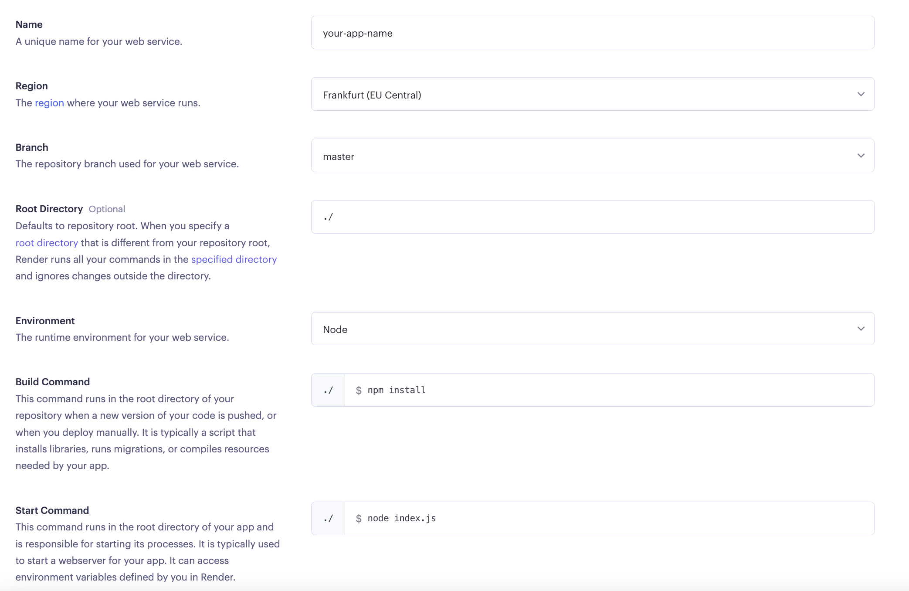
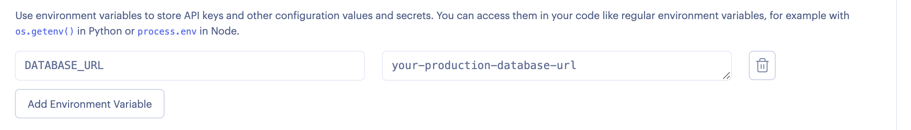

# 🚀 Deploy Backend on Render

As you know, a big part of software development is getting our apps live and out onto the web so users can start interacting with them. So here is a short tutorial on how to deploy our express apps on [Render](https://render.com/).

## 📇 App Set Up

Before deploying your app, you need to modify a few things, basically add some configuration for production, since right now we only have development config.

### Update the production environment on config.json

Add a dialect and an environment variable for the database URL, you can delete all the other existing config for production and keep only these two lines.

```json
// config/config.json

"production": {
    "use_env_variable": "DATABASE_URL",
    "dialect": "postgres",
  }
```

Once you are done with these changes, push the code or edit it directly on GitHub, just make sure you are deploying the updated version.

## 🌐 Render Set Up

### 1. Create an account on Render

Navigate to https://render.com/ and create an account, you can use GitHub for it.

### 2. Create a new Web Service

Once you create your account, you'll be greeted with a dashboard, chose the web service option.

### 3. Grant access to your repositories

If you are doing this for the first time, you need to authorize Render to access your repositories. I suggest giving access to all of them instead of just one, this will save you some time in the future.

### 4. Connect to repository

Use the search bar to find the repository you want to deploy, once you find it, click on connect.

### 5. Deploy config

#### Basic Config

Here you need to add some config about how to run your app, they are all very straightforward, but here is an example of how it should look like:



Content of the image:

**Name:** `here-goes-your-app-name`

**Region:** you can choose any region

**Branch:** your deployment branch, usually `master` or `main`, but it can be any.

**Environment:** `Node`

**Build Command:** `npm install`

**Start Command:** `node index.js` (it could also be `server.js` or any name you gave to it)

Once you filled up all these fields, scroll down and choose a plan, you probably want to go for the free one.

#### Advanced Config

Finally, click on the **Advanced** button, you need to add one environment variable, the one with the link to the database.



```
key = DATABASE_URL
value = your ElephantSQL link
```

> It's up to you if you want to use the same URL for production and development, you can either use the same or create a new one.

Click on **Create Web Service** and you are all done! 🎉
